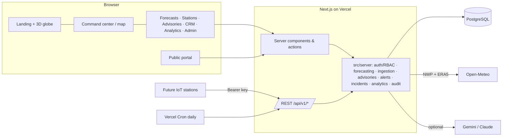

# CLIMATIQ

**Understand the Heat. Anticipate the Risk.**

CLIMATIQ is an AI-assisted climate-intelligence and heatwave-response platform for India: nationwide monitoring,
a transparent heat-risk forecasting model, human-approved AI advisories, automated alerts, response coordination and a
public climate portal — in one cinematic, role-aware web app.

> ⚠️ CLIMATIQ is a hackathon prototype and a **decision-support** tool. It is **not** an official meteorological
> service. CLIMATIQ forecasts and advisories are always labelled as such and never replace warnings from the India
> Meteorological Department (https://mausam.imd.gov.in) or disaster-management authorities.

Made by **GlazyKahito**.

---

## Highlights

| Module | What it does |
|---|---|
| **Cinematic homepage** (`/`) | Scroll-expansion hero, interactive 3D globe with real ERA5 heat data, live/replay overview, feature tour |
| **Climate command center** (`/command`) | India map with state/district heat-risk choropleth, 1° heat layer, stations, drilldown India → state → district, comparison mode, metric cards, side panels |
| **Heatwave prediction** (`/forecasts`) | 7-day forecasts for all 36 states/UTs and 230 pilot districts: uncertainty band, IMD-criteria-based severity, confidence, duration, contributing factors |
| **Weather stations** (`/stations`) | Simulated demo stations (clearly labelled) + authenticated REST ingestion API for future IoT stations |
| **AI advisories & alerts** (`/advisories`) | Gemini / Claude / deterministic-template providers, structured & validated output, 4 audiences, draft → approve → publish, deduplicated automated alerts, in-app notifications |
| **Response CRM** (`/response`) | Incidents, workflow, assignments, tasks, activity timeline, team workload |
| **Climate analytics** (`/analytics`) | 5-year history, heatwave frequency, comparisons, forecast-vs-observed accuracy, CSV export |
| **Public portal** (`/portal`) | Plain-language heat outlook, public advisories, safety guidance — no account needed |
| **Administration** (`/admin`) | Source & ingestion health, jobs, users & region-scoped roles, audit log, thresholds, safe demo reset |
| **Methodology** (`/methodology`) | Sources, model, severity mapping, uncertainty, limitations, privacy |

**Real data, honestly labelled.** History and normals come from ERA5 reanalysis, live guidance from Open-Meteo's
forecast API, and the demo's **historical replay** of the late-May 2024 North-India heatwave uses weather-model
forecasts *as they were issued* (Open-Meteo Previous Runs API) — so the hindcast never sees the future. Simulated
stations and fictional people/incidents are flagged everywhere.

## Quick start (local, one command)

```bash
cd climatiq
npm install
npm run dev
```

Then open **http://localhost:3100** (sign-in at `/login`, live build tracker at `/progress` in development).

On Windows you can also run it hidden in the background: `wscript scripts\windows\start-dev-background.vbs`
(logs in `.devserver.log`), and stop it with `powershell -File scripts\windows\stop-dev.ps1`.

`npm run dev` starts an embedded **PostgreSQL 18** (no Docker or install needed; data in `.data/pg`, port 54330),
applies the SQL migrations, seeds the demo (≈2 min on first run — it imports the committed real-data snapshot and runs
the forecasts), and launches Next.js. Requirements: Node 20.19+ (Node 24 tested), ~1 GB free disk.

### Demo accounts (all fictional)

One-click buttons on `/login` (demo mode only). Password for every demo account: `climatiq-demo`.

| Role | Name | Scope |
|---|---|---|
| System administrator | Aarav Mehta | All India |
| Climate analyst | Dr. Ishita Banerjee | All India |
| State administrator | Kavya Rathore | Rajasthan |
| District administrator | Dev Malhotra | Jaipur |
| Disaster-management official | Rohan Kulkarni / Sanjay Verma | Maharashtra / Uttar Pradesh |
| Regional response team | Arjun Singh / Meera Pillai | Rajasthan / Odisha |
| Field response team | Priya Sharma | Jaipur |
| Public user | Neha Gupta | — |

Switch roles any time from the account menu; restart the guided tour from the **?** button or Settings.

## Tech stack

Next.js 16 (App Router, Turbopack) · React 19 · TypeScript · Tailwind CSS 4 · GSAP + ScrollTrigger · Motion for React ·
three.js / React Three Fiber · MapLibre GL (OpenFreeMap) · Recharts · PostgreSQL 18 + Drizzle ORM · Zod · jose ·
Vitest + PGlite · Playwright + axe-core · Vercel + Neon.

## Architecture



Details: [`docs/ARCHITECTURE.md`](docs/ARCHITECTURE.md) · conventions: [`docs/DEV_GUIDE.md`](docs/DEV_GUIDE.md).

## Documentation

| Document | Contents |
|---|---|
| [`docs/ARCHITECTURE.md`](docs/ARCHITECTURE.md) | System design, modules, data flow, forecasting model, auth, database, testing strategy |
| [`docs/API.md`](docs/API.md) | REST endpoints, request/response shapes, auth requirements, errors |
| [`docs/DATA.md`](docs/DATA.md) | Data sources, provenance kinds, licences, committed snapshot, ingestion |
| [`docs/DEPLOYMENT.md`](docs/DEPLOYMENT.md) | Vercel + Neon deployment, environment variables, cron, troubleshooting |
| [`docs/DEMO.md`](docs/DEMO.md) | Demo walkthrough and presentation notes |
| [`docs/TEST_REPORT.md`](docs/TEST_REPORT.md) | Tests executed and results, accessibility, security and performance findings |
| [`docs/research/`](docs/research/) | Research notes behind data, AI, hosting and library choices |
| [`.env.example`](.env.example) | Every environment variable, described |

## Scripts

| Command | Purpose |
|---|---|
| `npm run dev` | Embedded Postgres + migrations + demo seed + dev server on :3100 |
| `npm run build` / `npm start` | Production build / server |
| `npm run db:generate` | Generate a SQL migration from `src/server/db/schema.ts` |
| `npm run db:migrate` | Apply migrations to `DATABASE_URL` |
| `npm run db:setup` | Migrate + seed demo data (when `DEMO_MODE=true`; idempotent) |
| `npm run ingest -- <history\|grid\|forecast\|all>` | Run ingestion jobs against `.env.local`'s database |
| `npm test` | Unit + integration tests (Vitest, in-memory PGlite) |
| `npm run test:e2e` | End-to-end + accessibility tests (Playwright, axe) |
| `npm run typecheck` / `npm run lint` | TypeScript / ESLint |

## Data, attribution & licences

Weather data by [Open-Meteo.com](https://open-meteo.com/) (CC BY 4.0), including ERA5 reanalysis (contains modified
Copernicus Climate Change Service information). Boundaries: [geoBoundaries](https://www.geoboundaries.org) (Runfola et
al. 2020; states CC BY 2.5 IN via DataMeet, districts ODbL 1.0) — simplified and **not authenticated by the Survey of
India**. Places © [GeoNames](https://www.geonames.org) (CC BY 4.0). Globe land: Natural Earth (public domain). Basemap:
OpenFreeMap / © OpenStreetMap contributors. See [`docs/DATA.md`](docs/DATA.md).

## Known limitations

- Statistical baseline model (no ML yet); uncertainty bands and confidence scores are heuristic, not calibrated.
- Severity approximates IMD criteria using a 5-year ERA5 reference instead of IMD's 1991–2020 station normals.
- No IMD warning feed (requires IMD approval); no physical weather stations (simulated + ingestion API only).
- In-app notifications only; Open-Meteo free tier is non-commercial and rate-limited.
- Districts cover seven pilot states/UTs; some district boundaries predate later reorganisations.
